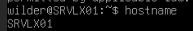
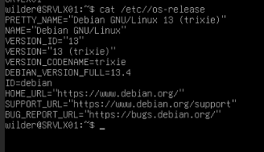
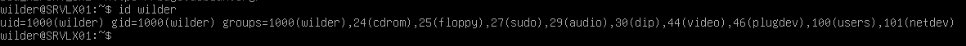
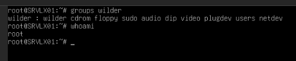
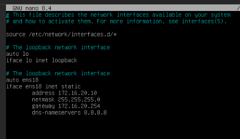
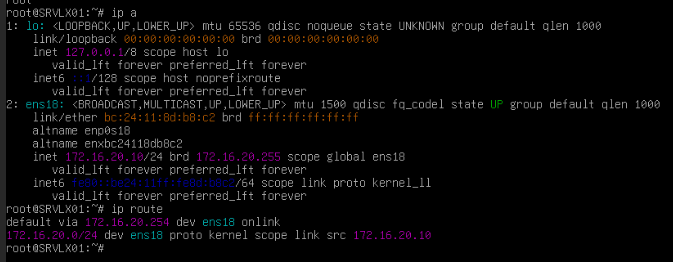
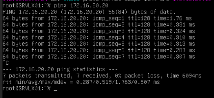
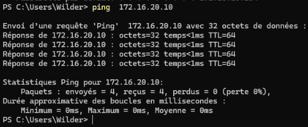
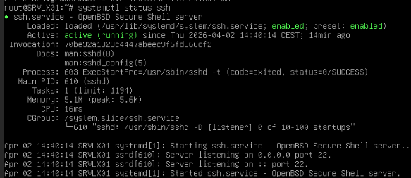
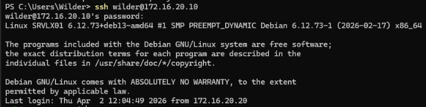

## Configuration de la machine client Windows 11 (CLIWIN01)

### Étape 1 : Vérification du nom de la machine

Exécutez la commande suivante :

```powershell
hostname
```

Si le nom n’est pas correct, renommez la machine :

```powershell
Rename-Computer -NewName CLIWIN01 -Restart
```


---

### Étape 2 : Vérification de l’utilisateur

Vérifiez que l’utilisateur Wilder existe :

```powershell
Get-LocalUser -Name "Wilder"
```

Si l’utilisateur n’existe pas :

```powershell
net user Wilder Azerty1* /add
```


---

### Étape 3 : Ajout au groupe Administrators

Ajoutez l’utilisateur au groupe Administrators :

```powershell
net localgroup Administrators Wilder /add
```

Vérifiez :

```powershell
net localgroup Administrators
```


---

### Étape 4 : Configuration réseau

Configurez l’adresse IP manuellement :

- Adresse IP : 172.16.20.20  
- Masque : 255.255.255.0  
- Passerelle : 172.16.20.254  
- DNS : 8.8.8.8  


---

### Étape 5 : Vérification réseau

```powershell
ipconfig
```


---

## Configuration de la machine serveur Debian 13 (SRVLX01)

### Étape 1 : Vérification du nom

```bash
hostname
```



---

### Étape 2 : Vérification du système

```bash
cat /etc/os-release
```



---

### Étape 3 : Vérification de l’utilisateur

```bash
id wilder
```

Si l’utilisateur n’existe pas :

```bash
adduser wilder
```

Mot de passe : Azerty1*



---

### Étape 4 : Ajout au groupe sudo

```bash
usermod -aG sudo wilder
```

Vérifiez :

```bash
groups wilder
```



---

### Étape 5 : Configuration réseau (permanente)

Éditez le fichier de configuration réseau :

```bash
nano /etc/network/interfaces
```



Enregistrez le fichier puis redémarrez le service réseau :

```bash
systemctl restart networking
```

Vérifiez la configuration :

```bash
ip a
ip route
```



---

## Test réseau

Depuis Windows 11 :

```powershell
ping 172.16.20.10
```

Depuis Debian :

```bash
ping 172.16.20.20
```

| Ping depuis Debian | Ping depuis Windows 11 |
| :---: | :---: |
|  |  |

---

## Installation et configuration SSH sur Debian

### Étape 1 : Installation du service SSH

Si nécessaire :

```bash
apt update
apt install openssh-server -y
systemctl enable ssh
systemctl start ssh
```

---

### Étape 2 : Vérification

```bash
systemctl status ssh
```

Le service doit être actif.



---

## Test de connexion SSH

Depuis Windows 11 :

```powershell
ssh wilder@172.16.20.10
```

Mot de passe : Azerty1*


