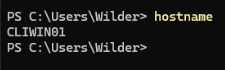

## Configuration de la machine client Windows 11 (CLIWIN01)

### Étape 1 : Vérification du nom de la machine

Exécutez la commande suivante :

```powershell
hostname
```

Si le nom n’est pas correct, renommez la machine :

```powershell
Rename-Computer -NewName CLIWIN01 -Restart
```

.

---

### Étape 2 : Vérification de l’utilisateur

Vérifiez que l’utilisateur Wilder existe :

```powershell
Get-LocalUser -Name "Wilder"
```

Si l’utilisateur n’existe pas :

```powershell
net user Wilder Azerty1* /add
```

Capture d’écran : résultat de Get-LocalUser.

---

### Étape 3 : Ajout au groupe Administrators

Ajoutez l’utilisateur au groupe Administrators :

```powershell
net localgroup Administrators Wilder /add
```

Vérifiez :

```powershell
net localgroup Administrators
```

Capture d’écran : présence de Wilder dans le groupe Administrators.

---

### Étape 4 : Configuration réseau

Configurez l’adresse IP manuellement :

- Adresse IP : 172.16.20.20  
- Masque : 255.255.255.0  
- Passerelle : 172.16.20.254  
- DNS : 8.8.8.8  

Capture d’écran : configuration IPv4.

---

### Étape 5 : Vérification réseau

```powershell
ipconfig
```

Capture d’écran : résultat de ipconfig.

---

## Configuration de la machine serveur Debian 13 (SRVLX01)

### Étape 1 : Vérification du nom

```bash
hostname
```

Capture d’écran : résultat de hostname.

---

### Étape 2 : Vérification du système

```bash
cat /etc/os-release
```

Capture d’écran : résultat de la commande.

---

### Étape 3 : Vérification de l’utilisateur

```bash
id wilder
```

Si l’utilisateur n’existe pas :

```bash
adduser wilder
```

Mot de passe : Azerty1*

Capture d’écran : résultat de id wilder.

---

### Étape 4 : Ajout au groupe sudo

```bash
usermod -aG sudo wilder
```

Vérifiez :

```bash
groups wilder
```

Capture d’écran : présence du groupe sudo.

---

### Étape 5 : Configuration réseau

Activez l’interface réseau :

```bash
ip link set ens18 up
```

Configurez l’adresse IP :

```bash
ip addr flush dev ens18
ip addr add 172.16.20.10/24 dev ens18
```

Configurez la passerelle :

```bash
ip route add default via 172.16.20.254
```

Configurez le DNS :

```bash
echo "nameserver 8.8.8.8" > /etc/resolv.conf
```

Vérifiez :

```bash
ip a
ip route
```

Capture d’écran : résultat de ip a et ip route.

---

## Test réseau

Depuis Windows 11 :

```powershell
ping 172.16.20.10
```

Depuis Debian :

```bash
ping 172.16.20.20
```

Capture d’écran : ping réussi.

---

## Installation et configuration SSH sur Debian

### Étape 1 : Installation du service SSH

Si nécessaire :

```bash
apt update
apt install openssh-server -y
systemctl enable ssh
systemctl start ssh
```

---

### Étape 2 : Vérification

```bash
systemctl status ssh
```

Le service doit être actif.

Capture d’écran : status SSH actif.

---

## Test de connexion SSH

Depuis Windows 11 :

```powershell
ssh wilder@172.16.20.10
```

Mot de passe : Azerty1*

Capture d’écran : connexion SSH réussie.
